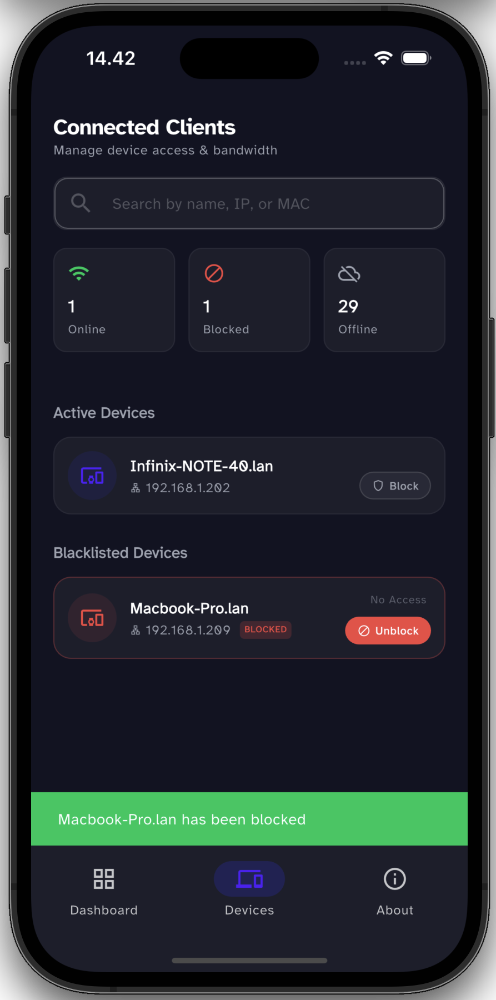
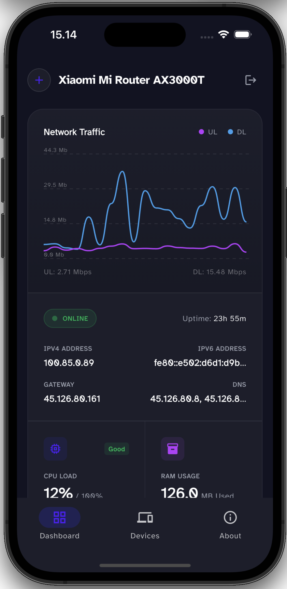

# Features Overview

WRTune packs powerful features into a clean, modern interface.

## Dashboard
The dashboard gives you an instant health check of your network:
- **Real-time Traffic**: view current upload/download speeds.
- **System Load**: Monitor CPU and Memory usage.
- **Port Status**: explicit indicators for WAN/LAN port connectivity.

## Device Management
Gain control over who is on your network.

- **Device List**: See all connected clients with their hostnames, IP, and MAC addresses.
- **One-Tap Block**: Instantly block internet access for specific devices.

## Traffic Monitoring
Understand your bandwidth usage.

### Historical Data
View traffic trends over time

## System Health
Deep dive into your router's performance.
- **Uptime**: Check how long your router has been running.
- **Storage**: Monitor disk usage for `/overlay` and other partitions.
