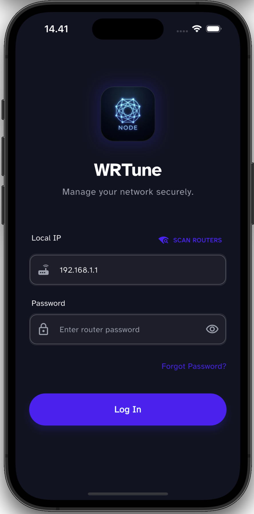

# Getting Started with WRTune

WRTune is designed to be a lightweight, easy-to-use companion for your OpenWRT router. This guide will help you get connected and start managing your network.

## Prerequisites

Before using WRTune, ensure you have:
1.  **OpenWRT Router**: A router running OpenWRT firmware (Version 22.03 or later recommended).
2.  **Network Access**: Your mobile device must be connected to the router's Wi-Fi or network.
3.  **WRTune Installed**: Get it from the [Google Play Store](https://play.google.com/store/apps/details?id=com.wrtune.app) (Android) or the upcoming App Store release (iOS).

## Initial Setup

### 1. Connect to Your Router
When you first launch WRTune, it will attempt to detect your router.
If automatic detection fails, you can manually enter your router's IP address (default is usually `192.168.1.1`).

### 2. Login
Enter your OpenWRT admin password.

> [!NOTE]
> WRTune uses the `ubus` (OpenWrt micro bus architecture) API for secure communication. Your credentials are used directly to authenticate with your router and are **never** sent to any external server.

### 3. Grant Permissions
For full functionality (like device blocking), WRTune manages firewall rules. It may ask for permission to create a `wrtune_` prefix rule set to ensure it doesn't conflict with your existing configuration.

## What's Next?
Once connected, you can:
- [Explore the Dashboard](features.md#dashboard)
- [Manage Connected Devices](features.md#device-management)
- [Monitor Traffic](features.md#traffic-monitoring)
